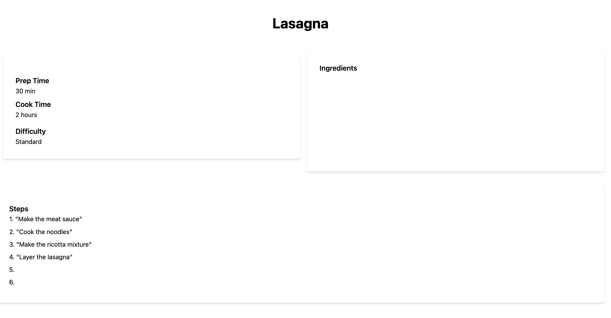

# Recipe generator 

## Description 

The motivation behind this project was to create a recipe website application where after signing in, users can post recipe data with content about specific recipe details that they can retrieve and view, which was created using both the front end and back end. We built this application because it creates a website for users to efficiently utilize recipe information so that that they can easily create and view that recipe information (prep time, cook time, ingredients, etc) in one place. It solves the problem of functionality and being able to incorporate a backend with routes and models so that users can input specific data they'd like to see. We learned about using handlebars, authentication and getting that to work together with my sequelize models as well as the CRUD routes to allow everything to work together.

## Installation 
First connect to the recipe_db by running "mysql -u root -p", source db/schema.sql and then create the database. 
Use "npm init -y" to retrieve the package.json file, and "npm i" to install the necesary modules. 
Use "npm run seed" to seed your data and then "npm run start" to start the application 

## Usage 
Link to Heroku site: 
https://culinarycanvas-ab69a55b38cf.herokuapp.com/profile

Instructions for ![LoginPage]: When you click Sign Up, you can sign up. When you click sign in with the same credentials, it will sign you in and send you to the profile page 
Instructions for ![ProfilePage]: When you input information for a recipe (lasagna), click the submit button 
Instructions for ![ProfilePage2]: The data you input for the recipe will appear on the right side as a link to view the full recipe page and list out all the recipes you input 
Instructions for ![RecipePage]: You can see the full recipe data 

## Credits 
Evan Chang, https://github.com/evan17812

Nikita Thomas, https://github.com/Nikitaaa95

Rong Si Deng, https://github.com/rosiedeng1

Yuval Nahmias, https://github.com/YuvNah

## License 
Please refer to the LICENSE in the repo